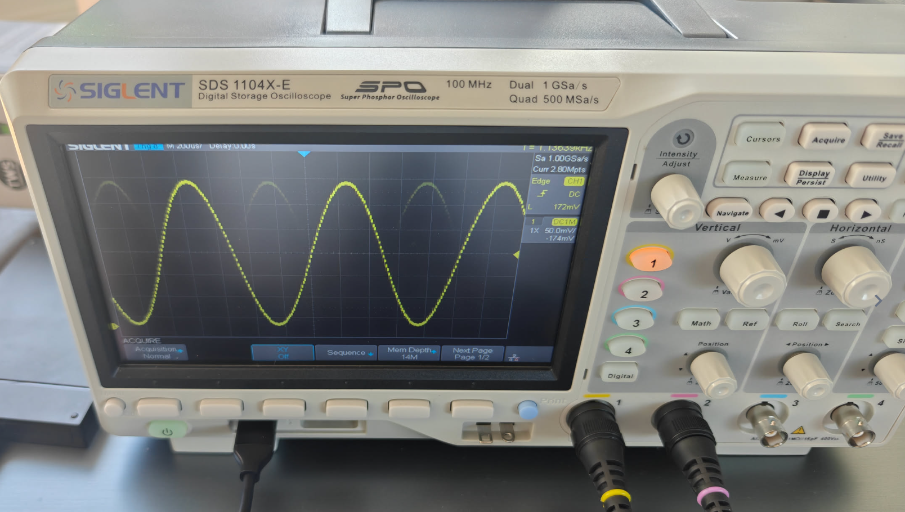
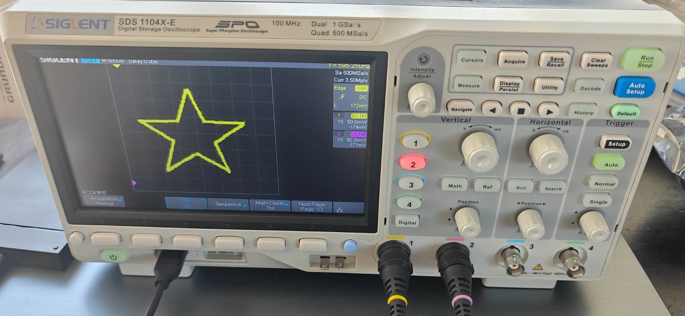
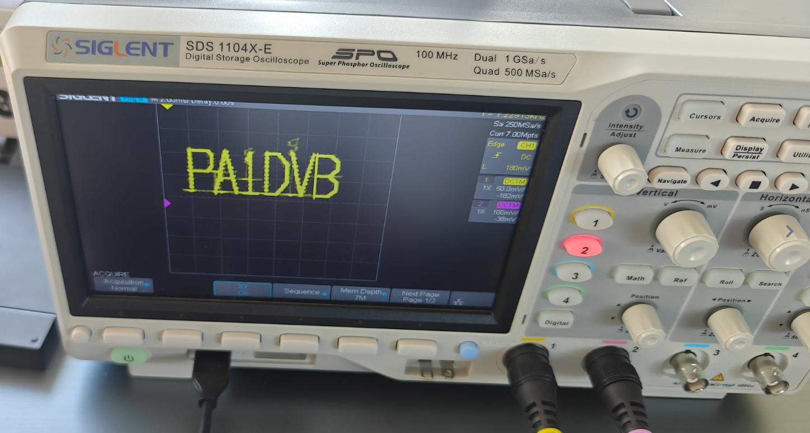

# ESP32 Test Generator

Dual-channel waveform / test-pattern generator for the ESP32-WROOM, controlled from a phone or laptop via a built-in web UI. Output is on the two on-chip DACs:

- **DAC1 → GPIO25** (X channel for X/Y patterns, in-phase for mono)
- **DAC2 → GPIO26** (Y channel for X/Y patterns, inverted for mono — handy for differential probing)

8-bit DACs at **50 kSPS** (Nyquist 25 kHz). 28 built-in waveforms including X/Y / Lissajous patterns for scope display.

## Gallery

Output captured on a Siglent SDS1104X-E:

| Sine (standard DAC mode) | Star (XY vector mode) | PA1DVB callsign (XY vector mode) |
|:---:|:---:|:---:|
|  |  |  |

## Features

- 39 waveforms in five groups:
  - **Standard** — Sine, Square, Triangle, Sawtooth ↑/↓, Pulse (adjustable duty), DC, White Noise
  - **Advanced** — Two-Tone, AM, FM, Chirp/Sweep, Sine Burst, Staircase, Gaussian, Sinc, ECG, Heartbeat
  - **X/Y Patterns** — Circle, Lissajous (1:2 / 2:3 / 3:4 / 3:5), Spiral, Rose, Star, Heart, Butterfly, Infinity
  - **Vector / Image** — Domoticz logo, PA1DVB callsign, Heart, Star, House (line-art shapes drawn on a scope in XY mode)
  - **Clock / RF** — square wave on **GPIO27** from 1 kHz to 40 MHz, with shortcuts for scope probe cal and odd-harmonic tuning into the FM broadcast and 2 m amateur bands
- Web UI with frequency, amplitude, DC offset, duty cycle, AM/FM modulation, chirp sweep range/time
- JSON REST API (`/api/state` GET/POST) for automation
- WiFiManager captive portal — no hard-coded SSID/password, configure on first boot
- ArduinoOTA — flash wirelessly after the first serial upload
- Settings persisted to SPIFFS, restored on boot
- Start/Stop control (DACs hold mid-scale when stopped)

## Hardware

| Item | Value |
|---|---|
| MCU | ESP32-WROOM (any classic ESP32 with both DACs available) |
| DAC1 output | GPIO25 |
| DAC2 output | GPIO26 |
| Clock / RF output | GPIO27 (square wave, LEDC peripheral, 1 kHz – 40 MHz) |
| Resolution | 8 bit (256 levels, ~13 mV/LSB at 3.3 V) |
| Sample rate | 100 kSPS (I²S DMA, ~80 ms ring buffer) |
| Output range | 0 – ~3.3 V (DC-coupled; use a coupling cap for AC) |
| Max useful frequency | DAC: ~50 kHz (Nyquist) &middot; Clock pin: 40 MHz fundamental, harmonics useful up to ~200 MHz |

DAC outputs are high-impedance and weak — buffer with an op-amp follower if you need to drive a load.

## Connecting to measurement equipment

On the DevKitC V4 the DAC pins are silkscreened **`D25` / `IO25`** and **`D26` / `IO26`** on the right-hand header (USB facing you, module up). A common ground between the ESP32 and your instrument is essential — use any `GND` pin on the board.

**Always clip every active probe's ground lead to an ESP32 `GND` pin**, as close to the signal pin as practical. Don't rely on "both devices are grounded somewhere" — the scope's BNC shield is mains earth, and the ESP32's USB ground may be floating; the potential difference shows up as 50/60 Hz hum plus high-frequency hash on top of your signal.

> ⚠️ Safety: because the scope ground is mains earth, only do this when the DUT is powered from an isolated or earthed supply (USB from a laptop or any normal USB charger is fine). Never clip a scope probe ground onto a circuit driven by a transformerless mains supply.

```
ESP32 GPIO25 ──────────────► scope CH1 tip   (or X input for X/Y mode)
ESP32 GPIO26 ──────────────► scope CH2 tip   (or Y input for X/Y mode)
ESP32 GND    ──────────────► scope ground clip(s)
```

**Oscilloscope starting settings**

- Coupling: **DC** (the DAC idles at ~1.65 V mid-scale)
- Volts/div: **500 mV/div** (full swing is ~3.1 Vpp)
- Probe attenuation: 1× or 10× both fine
- For X/Y patterns: switch the scope to **XY mode** (CH1 = X, CH2 = Y), 500 mV/div on both, centre both traces

**Multimeter**

- **DC volts** — try the `dc` waveform with different Offset values to verify range (≈0 V at -100 %, ≈1.65 V at 0 %, ≈3.1 V at +100 %).
- **AC volts** for periodic waveforms — note your DMM's bandwidth (most handhelds roll off above 400 Hz – 1 kHz, so don't trust amplitude readings of a 5 kHz sine).

**Sanity check after flashing**

1. Pick `dc` waveform, Offset = 0, Apply → both pins read ~1.65 V on a DMM.
2. Pick `sine`, 100 Hz, Amplitude 100 %, Offset 0 → scope shows a clean ~3 Vpp sine on CH1 and the same signal inverted on CH2.
3. Pick `xy_circle`, frequency 200 Hz, scope in XY mode → round circle on the screen.
4. Pick `vec_domoticz` (still in XY mode), frequency 50 Hz → Domoticz logo. For vector waveforms the **Frequency** knob is reinterpreted as pattern *refresh rate* (Hz); 30–100 Hz is the sweet spot. Below 20 Hz it flickers; above 200 Hz the trace becomes dim because each edge is drawn with too few samples.

## Clock / RF mode

A separate output on **GPIO27** generates a clean 0/3.3 V square wave from 1 kHz to 40 MHz via the LEDC peripheral. The DAC outputs go quiet (held at mid-scale) while a Clock waveform is selected.

### Scope use

- **`clk_probe_cal`** (1 kHz) — connect probe tip and ground to GPIO27 + a nearby GND. Adjust your probe's compensation trimmer until the square wave is flat-topped (not over/under-shooting). Standard procedure for every probe before measurement.
- **`clk_1m` / `clk_10m`** — measure the rise time on your scope. Rise-time × 0.35 ≈ scope/probe bandwidth. A 10 MHz square with a 35 ns rise time implies ~10 MHz bandwidth; sharper means better.
- **`clk_var` at 20–40 MHz** — see if the scope can still resolve the edges. Most cheap hobby scopes start rolling off around 20–50 MHz.

### Ham / RF use

A 30 cm wire (≈ ¼ λ at 100 MHz) clipped onto GPIO27 acts as a serviceable antenna for a nearby receiver.

A square wave has strong **odd harmonics** at frequencies 3f, 5f, 7f, … with amplitude ~1/n. So a single fundamental gives you signals at *several* points on the dial:

- **`clk_fm`** (30 MHz fundamental) → 3rd harmonic at **90 MHz**, right in the FM broadcast band. Tune your FM receiver near 90.0 MHz to find it (also 150 MHz on the 5th, 210 MHz on the 7th, etc.). Useful for testing receiver sensitivity, AGC, and S-meter.
- **`clk_2m`** (29 MHz fundamental) → 5th harmonic at **145 MHz**, in the 2 m amateur band. Tune your 2 m rig to 145.0 MHz; you should hear a steady carrier.
- **`clk_var`** with the Frequency knob set freely between 1 kHz and 40 MHz lets you place the fundamental — or any of its odd harmonics — exactly where you want.

> ⚠️ The unfiltered square wave puts out energy across the entire spectrum. Don't connect a long antenna and leave it running indefinitely — you'll be illegally broadcasting on many bands at once. Use a short wire, keep the duration short, and don't transmit on bands you're not licensed for.

### Going further — Si5351A breakout (optional)

The on-board LEDC clock has two real limitations:

- **40 MHz fundamental ceiling** — anything higher only via odd harmonics, which means weak signal and lots of unwanted spurs on other bands.
- **Coarse frequency steps** — LEDC derives its clock from integer dividers off the 80 MHz APB, so you can't land on exactly 90.000 MHz; the actual output is wherever the nearest valid divider puts you.

The fix is an **Si5351A clock-generator breakout** (Adafruit P/N 2045, or any of the cheap clones — ~€5–10). It's a tiny I²C-controlled IC that puts out three independent square-wave clocks from 2.5 kHz up to 200 MHz with sub-Hz precision via a fractional PLL.

**Support is already in the codebase but disabled by default**, so the sketch compiles fine without the chip or library installed. Enable it in three steps:

1. **Wire the breakout** to the ESP32:

   | Si5351 pin | ESP32 pin |
   |---|---|
   | VIN | 3V3 |
   | GND | GND |
   | SDA | GPIO21 |
   | SCL | GPIO22 |
   | CLK0 | RF output → receiver / antenna |

2. **Install the library** via the Arduino IDE → Tools → Manage Libraries → search **"Etherkit Si5351"** → Install.

3. **Flip the flag** in `TestGenerator/Features.h`:
   ```c
   #define ENABLE_SI5351 1
   ```
   Recompile and upload. A new **Si5351 RF (CLK0)** group appears in the waveform dropdown with seven entries:

   | ID | Frequency | Use |
   |---|---|---|
   | `si_10m_ref` | 10.000000 MHz | Calibration tone (clean reference for receiver alignment) |
   | `si_wspr_40m` | 7.040100 MHz | WSPR centre, 40 m band |
   | `si_wspr_20m` | 14.097100 MHz | WSPR centre, 20 m band |
   | `si_fm` | 90.000 MHz | FM broadcast band |
   | `si_2m` | 145.500 MHz | 2 m amateur calling frequency |
   | `si_70cm` | 435.000 MHz | 70 cm amateur calling frequency |
   | `si_var` | 2.5 kHz – 200 MHz | Free-tune via the Frequency knob |

If the chip isn't detected on I²C at boot, the sketch logs `Si5351: not detected on I²C (continuing without it)` and the menu items become no-ops — the rest of the generator keeps working.

Only CLK0 is exposed in the UI for now; the chip has CLK1 and CLK2 too (drive_strength is already set for all three in `Si5351RF.ino` if you want to wire them up).

### Going further — power amplification (~5 W out)

The Si5351A's raw output is around +10 dBm (~10 mW) — fine for receiver testing on a short wire from across the room, nowhere near enough for real on-air operation. Boosting to **5 W (+37 dBm)** is a +27 dB chain, well-trodden in QRP circles but with a few non-negotiables:

1. **Low-pass filter between Si5351 and PA.** The Si5351 emits a square wave, which carries strong energy on every odd harmonic (3f, 5f, 7f, …). Amplifying that directly broadcasts on multiple bands at once — illegal and a waste of PA dissipation. A 5- or 7-element Chebyshev LPF with cutoff just above your target band cleans it to a usable sine.
2. **A band-appropriate PA module:**
   - **HF (1.8–30 MHz)** — discrete IRF510 push-pull class-E (~5 W, ~€5 in parts), or a Mitsubishi **RD15HVF1** module.
   - **VHF (144 MHz)** — Mitsubishi **RA08H1317M** (8 W) or **RA13H1317M** (13 W). Drop-in hybrid modules, internally biased.
   - **UHF (430 MHz)** — Mitsubishi **RA13H4047M** (13 W) or **RA30H4047M** (30 W).
3. **A second LPF after the PA** to clean up harmonics the amplifier itself generates.
4. **Heatsink + 12 V / ~1 A supply** for the PA.
5. **An SWR meter** between PA and antenna — at 5 W into a bad match, a typical hybrid module dies in seconds.

Signal chain:
```
Si5351 CLK0 ──► LPF1 ──► PA module ──► LPF2 ──► SWR meter ──► Antenna
                          ▲
                          12 V @ ~1 A, on a heatsink
```

**Easier alternative for HF**: QRP Labs' [QCX Mini](https://qrp-labs.com/qcxmini.html) (~€55) is a complete 5 W single-band HF CW transceiver kit. It already contains an Si5351 as its VFO, plus all the filtering and the PA. Using our ESP32-driven Si5351 as an external VFO into one of these kits gives you 5 W cleanly with everything done right by people who do this for a living.

> ⚠️ 5 W into a real antenna is transmitting. Stay on bands your licence covers (amateur HF/VHF/UHF for licensed hams). Never on FM broadcast (88–108 MHz), commercial, aviation or public-safety bands — no exceptions, regardless of "but it's just a test". Always SWR-check before keying.

**Driving a load**

DAC outputs are weak (~few hundred Ω source impedance). For a 1 MΩ scope input you're fine. For any real load — speaker, filter input, long cable — buffer with a unity-gain op-amp follower (MCP6002, LM358, TL072, etc.). The output is DC-coupled 0 – ~3.1 V; add a series ~10 µF capacitor if you need a bipolar AC signal.

## Software requirements

- [Arduino IDE 2.x](https://www.arduino.cc/en/software)
- [ESP32 board package](https://docs.espressif.com/projects/arduino-esp32/en/latest/installing.html) (Espressif)
- Libraries (Library Manager):
  - **WiFiManager** by tzapu
  - **ArduinoJson**

Built-in libraries (`WiFi`, `WebServer`, `ArduinoOTA`, `SPIFFS`, `driver/dac`) ship with the ESP32 core.

## Build & flash

1. Clone this repo.
2. Open `TestGenerator/TestGenerator.ino` in the Arduino IDE.
3. Board: **ESP32 Dev Module** (or **ESP32-WROOM-DA Module**).
4. Partition scheme: any layout that includes SPIFFS, e.g. *Default 4MB with spiffs*.
5. Select your serial port and Upload.

Subsequent flashes can use OTA (network port appears in the IDE once the device is on WiFi; password = device hostname, e.g. `TESTGEN-A4B12C3D4E5F`).

## First-time setup

1. On first boot the device starts a WiFi AP named `TESTGEN-<mac>` (no password).
2. Connect a phone/laptop to it — a captive-portal page should appear automatically (otherwise browse to `http://192.168.4.1`).
3. Choose your home WiFi and enter the password. The device reboots and joins your network.
4. Look at the serial monitor or your router for the assigned IP, then browse to it. The hostname `TESTGEN-<mac>` is also advertised via mDNS.
5. Pick a waveform, set parameters, Apply.

To re-do the WiFi setup, open the web UI and click **Reset WiFi** (or hold up a serial console and reflash).

## Web API

`GET /api/state` returns the current settings as JSON:

```json
{
  "wave": "sine",
  "frequency": 1000.0,
  "amplitude": 100.0,
  "offset": 0.0,
  "duty": 50.0,
  "mod_freq": 5.0,
  "mod_depth": 50.0,
  "sweep_low": 100.0,
  "sweep_high": 5000.0,
  "sweep_time": 1.0,
  "running": true,
  "ip": "192.168.1.42",
  "rssi": -54,
  "device": "TESTGEN-A4B12C3D4E5F",
  "version": "2026.05.25 rev 1.0"
}
```

`POST /api/state` with a JSON body containing any subset of those fields applies and persists them. Example:

```bash
curl -X POST http://testgen-a4b12c3d4e5f.local/api/state \
     -H 'Content-Type: application/json' \
     -d '{"wave":"xy_lissajous_2_3","frequency":200,"running":true}'
```

Waveform IDs are the `id` strings in `Waveforms.ino` (`sine`, `square`, `triangle`, `saw_up`, `saw_down`, `pulse`, `dc`, `noise_white`, `two_tone`, `am`, `fm`, `chirp`, `burst`, `staircase`, `gaussian`, `sinc`, `ecg`, `heartbeat`, `xy_circle`, `xy_liss_1_2`, `xy_liss_2_3`, `xy_liss_3_4`, `xy_liss_3_5`, `xy_spiral`, `xy_rose`, `xy_star`, `xy_heart`, `xy_butterfly`, `xy_infinity`, `vec_domoticz`, `vec_callsign`, `vec_heart`, `vec_star`, `vec_house`, `clk_probe_cal`, `clk_1m`, `clk_10m`, `clk_fm`, `clk_2m`, `clk_var`).

## Parameter reference

| Parameter | Range | Used by |
|---|---|---|
| Frequency | 0.1 – 20000 Hz | all (X/Y: pattern cycles/sec; Vector: pattern refresh rate Hz, 30–100 sweet spot) |
| Amplitude | 0 – 100 % | all |
| DC Offset | -100 – +100 % | all |
| Duty cycle | 1 – 99 % | Pulse, Burst |
| Mod Freq | 0.1 – 5000 Hz | Two-Tone, AM, FM, Burst rate, Spiral |
| Mod Depth | 0 – 100 % | AM index, FM deviation, Spiral expansion |
| Sweep Low / High / Time | Hz / Hz / s | Chirp |

## Project layout

```
TestGenerator/
  TestGenerator.ino   main sketch: setup(), loop(), globals
  Config.h            persisted settings (SPIFFS / config.json)
  Waveforms.h         waveform catalogue + engine API
  Waveforms.ino       DDS engine, I²S DMA, sample-feeder task
  Vectors.h           vector mesh struct
  Vectors.ino         line-art mesh data (logo, callsign, shapes)
  ClockOut.h          LEDC square-wave clock API
  ClockOut.ino        1 kHz – 40 MHz square wave on GPIO27
  Features.h          compile-time feature flags (ENABLE_SI5351, ...)
  Si5351RF.h          Si5351A clock-generator API (compiled out by default)
  Si5351RF.ino        Si5351A driver wrapper (compiled out by default)
  WiFiSetup.ino       WiFiManager + ArduinoOTA + mDNS
  WebServer.ino       HTTP routes, web UI, JSON API
```

The sample task runs pinned to core 0 at high priority; web/WiFi/OTA run on core 1. See `CLAUDE.md` for architecture details if you want to extend the codebase.

## License

MIT — see [LICENSE](LICENSE).

## Author

(c) 2026 PA1DVB
